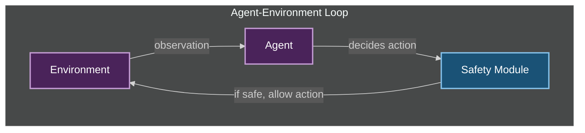

```mermaid
%%{init: {'theme': 'dark'}}%%
%%{init: {'themeVariables': { 'background': '#000000', 'primaryTextColor': '#ffffff'}}}%%
graph LR
    %% Style definitions
    classDef mainLoop fill:#4a235a,stroke:#c39bd3,stroke-width:2px,color:#fff
    classDef safetyModule fill:#1a5276,stroke:#85c1e9,stroke-width:2px,color:#fff

    %% Main components with minimal detail
    subgraph AgentEnvLoop[Agent-Environment Loop]
        direction LR
        Env[Environment] --> |observation| Agent
        Agent --> |decides action| Safety[Safety Module]
        Safety --> |if safe, allow action| Env
    end

    %% Apply styles
    class Agent,Env mainLoop
    class Safety safetyModule
```
