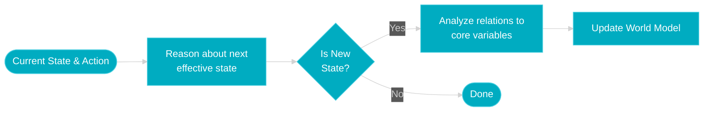

```mermaid
%%{init: {'theme': 'dark'}}%%
%%{init: {'themeVariables': { 'background': '#0a0a0a', 'primaryTextColor': '#ffffff'}}}%%
graph LR
    %% Style definitions
    classDef process fill:#00acc1,stroke:#4dd0e1,color:#fff
    classDef decision fill:#00acc1,stroke:#4dd0e1,color:#fff,shape:diamond
    classDef state fill:#006064,stroke:#4dd0e1,color:#fff,stroke-dasharray: 5 5

    %% Main flow
    Start([Current State & Action]) --> Reason[Reason about next<br/>effective state]
    Reason --> IsNew{Is New<br/>State?}
    IsNew -->|Yes| Relations[Analyze relations to<br/>core variables]
    Relations --> Update[Update World Model]
    IsNew -->|No| Done([Done])

    %% Apply styles
    class Start,Reason,Relations,Update,Done process
    class IsNew decision
```
