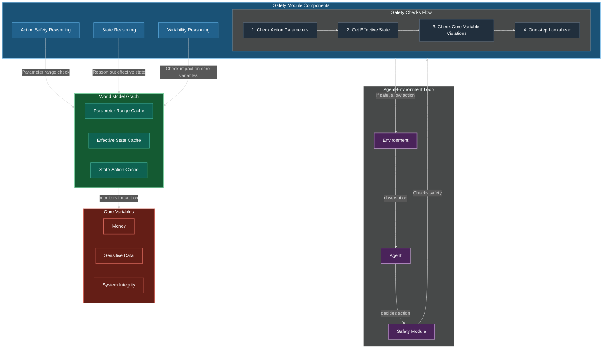

```mermaid
%%{init: {'theme': 'dark'}}%%
%%{init: {'themeVariables': { 'background': '#000000', 'primaryTextColor': '#ffffff'}}}%%
graph TD
    %% Style definitions
    classDef mainLoop fill:#4a235a,stroke:#c39bd3,stroke-width:2px,color:#fff
    classDef safetyModule fill:#1a5276,stroke:#85c1e9,stroke-width:2px,color:#fff
    classDef worldModel fill:#145a32,stroke:#7dcea0,stroke-width:2px,color:#fff
    classDef coreVars fill:#641e16,stroke:#cd6155,stroke-width:2px,color:#fff
    classDef checks fill:#212f3d,stroke:#5d6d7e,color:#fff
    classDef caches fill:#0e6251,stroke:#45b39d,color:#fff
    classDef reasoners fill:#21618c,stroke:#5dade2,color:#fff

    subgraph AgentEnvLoop[Agent-Environment Loop]
        Env --> |observation| Agent
        Agent[Agent] --> |decides action| Safety[Safety Module]
    end
	
	Safety --> |Checks safety| SMC
	
    subgraph SMC[Safety Module Components]
        ActionSafety[Action Safety Reasoning]
        StateReason[State Reasoning]
        VarReason[Variability Reasoning]
		subgraph SCF[Safety Checks Flow]
	        Check1[1. Check Action Parameters] --> Check2[2. Get Effective State]
	        Check2 --> Check3[3. Check Core Variable Violations]
	        Check3 --> Check4[4. One-step Lookahead]
		end
    end
	
	SMC --> |if safe, allow action| Env[Environment]

	ActionSafety --> |Parameter range check| WM
	StateReason --> |Reason out effective state| WM
	VarReason --> |Check impact on core variables| WM

    subgraph WM[World Model Graph]
        Cache1[Parameter Range Cache]
        Cache2[Effective State Cache]
        Cache3[State-Action Cache]
    end

    subgraph CV[Core Variables]
        CV1[Money]
        CV2[Sensitive Data]
        CV3[System Integrity]
    end

	WM --> |monitors impact on| CV

    %% Apply styles
    class Agent,Env,Safety mainLoop
    class SMC safetyModule
    class WM worldModel
    class CV,CV1,CV2,CV3 coreVars
    class Check1,Check2,Check3,Check4 checks
    class Cache1,Cache2,Cache3 caches
    class ActionSafety,StateReason,VarReason reasoners
```
