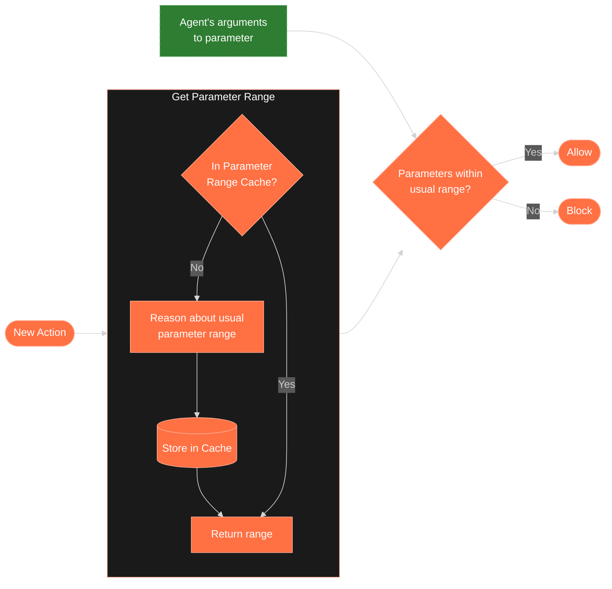

```mermaid
%%{init: {'theme': 'dark'}}%%
%%{init: {'themeVariables': { 'background': '#0a0a0a', 'primaryTextColor': '#ffffff'}}}%%
graph LR
    %% Style definitions
    classDef process fill:#ff7043,stroke:#ffab91,color:#fff
    classDef decision fill:#ff7043,stroke:#ffab91,color:#fff,shape:diamond
    classDef cache fill:#ff7043,stroke:#ffab91,color:#fff,shape:cylinder
    classDef subBox fill:#1a1a1a,stroke:#ffab91,stroke-width:1px,color:#fff
    classDef agentInput fill:#2e7d32,stroke:#81c784,color:#fff,stroke-dasharray: 5 5

    %% Main flow
    Start([New Action]) --> GetParam
    
    subgraph GetParam[Get Parameter Range]
        direction TB
        CacheCheck{In Parameter<br/>Range Cache?}
        CacheCheck -->|No| Reason[Reason about usual<br/>parameter range]
        Reason --> Store[(Store in Cache)]
        Store --> Result[Return range]
        CacheCheck -->|Yes| Result
    end
    
    %% Validation with agent input
    GetParam --> Validate{Parameters within<br/>usual range?}
    AgentArgs[Agent's arguments<br/>to parameter] --> Validate
    Validate -->|Yes| Allow([Allow])
    Validate -->|No| Block([Block])

    %% Apply styles
    class Start,Reason,Result,Allow,Block process
    class CacheCheck,Validate decision
    class Store cache
    class AgentArgs agentInput
    class GetParam subBox
```
