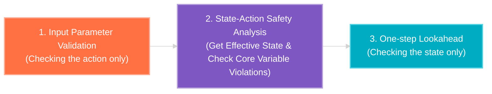

```mermaid
%%{init: {'theme': 'dark'}}%%
%%{init: {'themeVariables': { 'background': '#000000', 'primaryTextColor': '#ffffff'}}}%%
graph LR
    %% Style definitions
    classDef paramCheck fill:#ff7043,stroke:#ffab91,stroke-width:2px,color:#fff
    classDef stateCheck fill:#7e57c2,stroke:#b39ddb,stroke-width:2px,color:#fff
    classDef lookAhead fill:#00acc1,stroke:#4dd0e1,stroke-width:2px,color:#fff

    %% Safety checks flow
    Check1["1. Input Parameter Validation<br/>(Checking the action only)"] --> Check2["2. State-Action Safety Analysis<br/>(Get Effective State & Check Core Variable Violations)"]
    Check2 --> Check3["3. One-step Lookahead<br/>(Checking the state only)"]

    %% Apply styles
    class Check1 paramCheck
    class Check2 stateCheck
    class Check3 lookAhead
```
