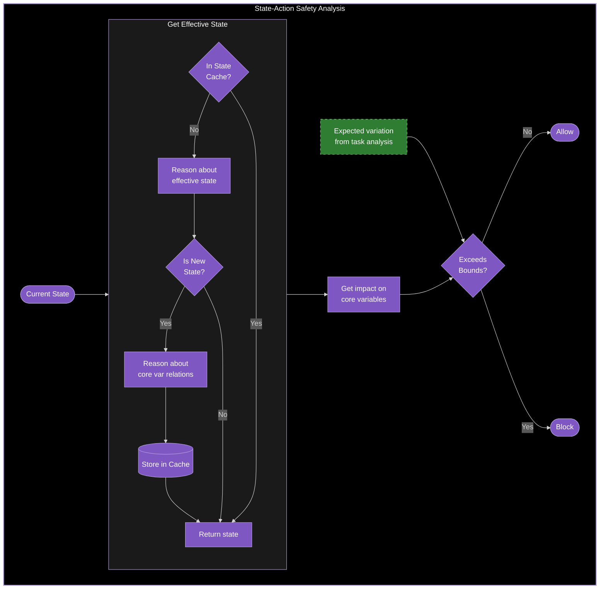

```mermaid
%%{init: {'theme': 'dark'}}%%
%%{init: {'themeVariables': { 'background': '#0a0a0a', 'primaryTextColor': '#ffffff'}}}%%
graph LR
    %% Style definitions
    classDef mainBox fill:#000000,stroke:#b39ddb,stroke-width:2px,color:#fff
    classDef process fill:#7e57c2,stroke:#b39ddb,color:#fff
    classDef decision fill:#7e57c2,stroke:#b39ddb,color:#fff,shape:diamond
    classDef cache fill:#7e57c2,stroke:#b39ddb,color:#fff,shape:cylinder
    classDef bounds fill:#2e7d32,stroke:#81c784,color:#fff,stroke-dasharray: 5 5
    classDef subBox fill:#1a1a1a,stroke:#b39ddb,stroke-width:1px,color:#fff

    %% Main container
    subgraph SA[State-Action Safety Analysis]
        direction LR
        Start([Current State]) --> GetEffective

        subgraph GetEffective[Get Effective State]
            direction TB
            StateCheck{In State<br/>Cache?}
            StateCheck -->|No| Reason[Reason about<br/>effective state]
            Reason --> IsNew{Is New<br/>State?}
            IsNew -->|Yes| Relations[Reason about<br/>core var relations]
            Relations --> Store[(Store in Cache)]
            Store --> Result[Return state]
            IsNew -->|No| Result
            StateCheck -->|Yes| Result
        end

        %% Violation Check Flow
        GetEffective --> Impact[Get impact on<br/>core variables]
        Expected[Expected variation<br/>from task analysis] --> Compare
        Impact --> Compare{Exceeds<br/>Bounds?}
        Compare -->|No| Allow([Allow])
        Compare -->|Yes| Block([Block])
    end

    %% Apply styles
    class SA mainBox
    class GetEffective subBox
    class Start,Reason,Relations,Result,Impact,Allow,Block process
    class StateCheck,IsNew,Compare decision
    class Store cache
    class Expected bounds
```
